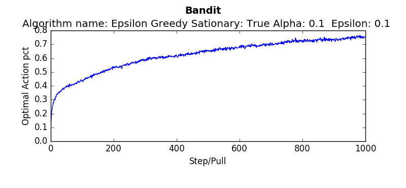
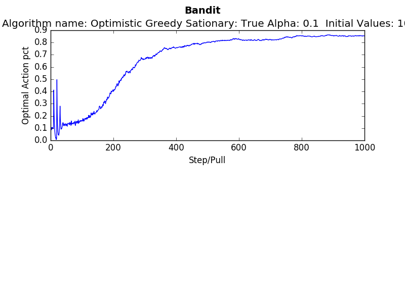
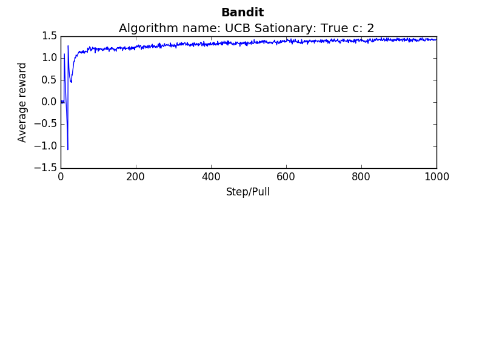
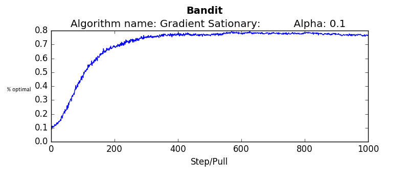
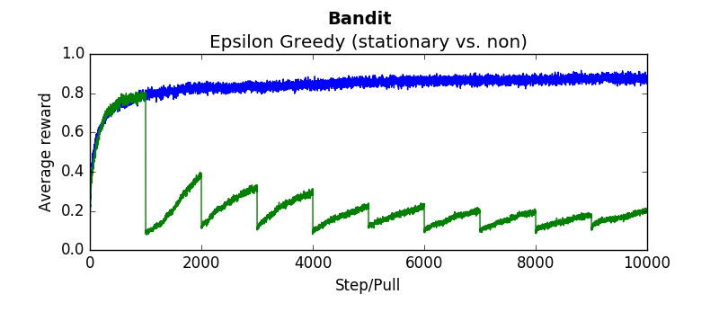
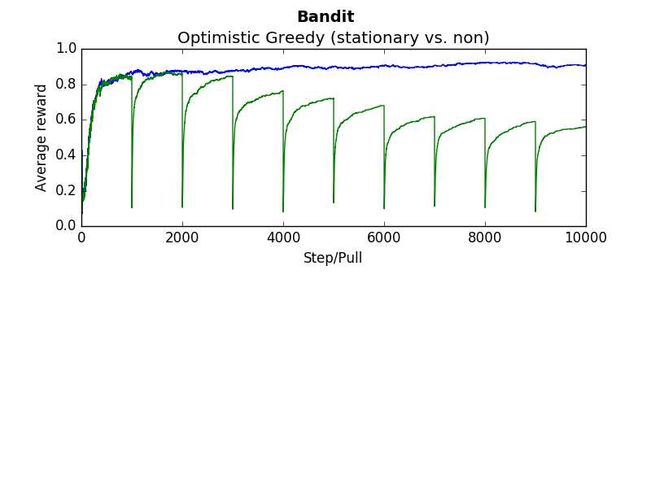
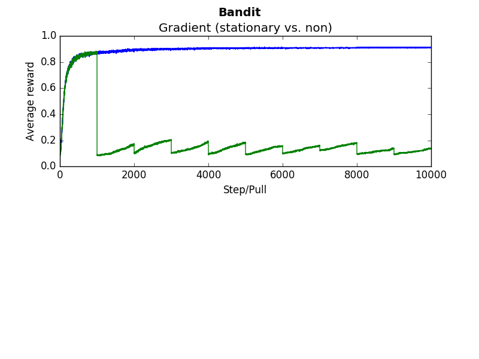
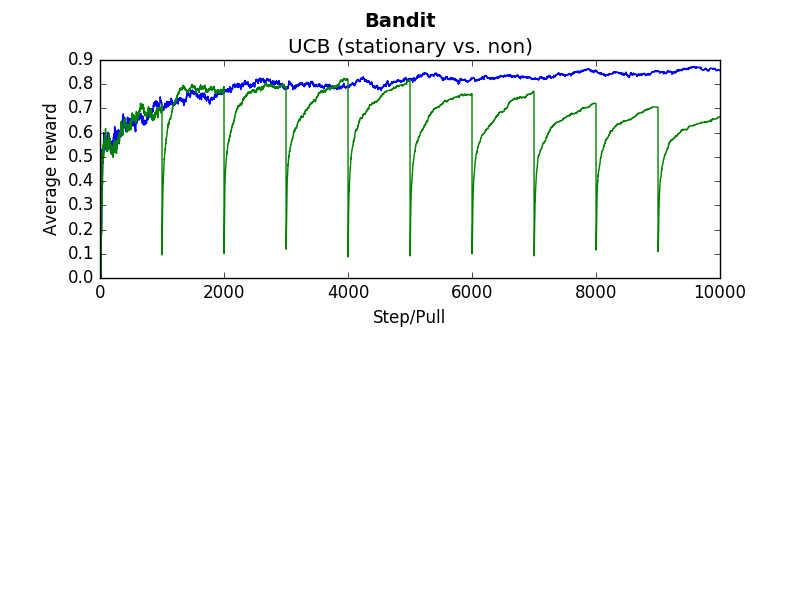
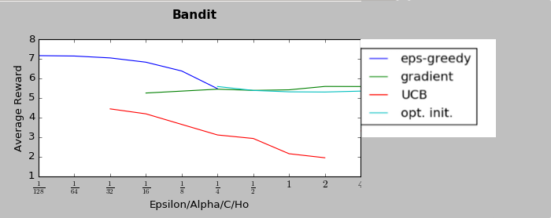

#Introduction to Reinforcement Learning via Non-Stationary bandits

##Problem Description
Imagine a slot machine with multiple arms that can be pulled. However, unlike most slot machines, imagine this machine actually has a "best" arm to pull. If the reward you received from each arm was deterministic, learning which arm to pull would be simple. Just pull each arm, keep track of which arm received the most reward, and then start picking that arm each pull in the future. However, for practical bandit problems, it is not so simple for several reasons:
- The values returned are stochastic. So the task of determining which arm to pull requires sampling from several different arms several times
- You must balance exploration with exploitation given your task is to maximize rewards - not just determine which is the "best" arm.
- The mean value of these arms may change over time. This is considered "non-stationary." Given this type of environment, exploration is constantly needed.

##Solution
Reinforcement Learning provides classes of solutions for this type of problem. These solutions allow intelligent "agents" to learn through self generated experience. The agent experiences the world, and through this experimentation, begins to learn what is good a nd bad, with respect to an end goal. This could be contrasted to supervised learning, where the agent is explicitly told what is the right answer, through thousands, millions, billions or more training examples. Like a child being shown flash cards of objects, the agent eventually learns. While the flashcards are akin to rote supervised learning, in contrast, a child learning to perceive a dog, does so by experiencing interacting with the dog touching, feeling, and listening to it's bark, is comparable to reinforcement learning. The promise of reinforcement learning is that because this experience is self generated, and more general, it can scale better than simple supervised rote learning.
With this definition, it is easy to see that Reinforcement Learning could be a strong and appropriate solution set for the problem of determining which arm to pull, given a multi arm bandit.


While the multi arm bandit is a fantastic problem to initially study in Reinforcement Learning (and also powerful in practice),  it would be remiss not to mention it’s position within the field. The full reinforcement learning problem includes several states for which the agent experiences. In the multi arm bandit problem, there is one state, the state of sitting in front of the bandit, determining which arm to pull. But in reality, most problems include the agent traversing the environment, experiencing many different states. At each state, the agent must learn the appropriate action. These multi-state system introduce many complexities, especially with the reality that some systems contain many more states than atoms in the universe and thus function approximation(the famous example of the game of Go). However, bandits are sufficient in helping understand the basic Reinforcement Learning problem and it’s class of solutions.


Many introductions to reinforcement learning include dependencies on tools such as tensor flow or environments like openAI gym. While fantastic tools, they're unnecessary for implementing a learning algorithm for bandits, and therefor overcomplicate the issue for the beginner.
Hopefully, this github repository can demonstrate the simplicity and power of a problem suitable for reinforcement learning, as well as an solution. All that is needed is python.

Because of the simplicity of bandits, all that is needed to study the solution is python. No sophisticated virtual environments, no simulators. Therfore, this =is a


##Reinforcement Learning ...
The basic reinforcement learning framework is simple. The agent (your algorithm) determines what state it's in based off of some sensation, determines what action to take (based on what it's learned), and performs this action withoin the environment. The environment responds with a reward and state update. In the bandit example, there is only one state, so the agent, based on experience decides which arm to pull. Once pulled, the environment responds with a reward (the amount recieved from pulling the slot machine). If the reward was largely positive, the agent would be wise to favor this action in the future. Conversly, if the reward was negative, the agent would be wise to avoid this. This of course is over simplifying. Life, and the bandit example, is stochastic. You may pull an arm of the bandit and recieve a negative reward, but there is a massive jackpot waiting 2 pulls away. Therein lies the balance between exploration and exploitation. A successful player at the casino would balance pulling the most optimal arm of the bandit with the reality that they may not know the most optimal, and require exploration. Nevertheless, the basic Reinforcement Loop is simple. The agent senses it's state, determines it's "best action", takes that action, and is given a reward. Given that reward, it learns what it may do in the future to perform even better.


Therefore, any reinforcement learning agent is responsible for 2 things.
- To provide a policy - given a state (or state estimate in more sophisticated examples beyond a bandit), what actions should I perform? This is refered to as the policy.
- To learn from the experience of taking an action and experience the consequences.

1. The policy.
Given the exploration vs exploitation trade off, the agent can not always simply take the action it thinks is the best action. Consider sitting at the casino in front of a ten arm bandit. After pulling each arm, the best arm resulted in a reward of 10, the second best arm 9,third best 5, and all others were 0. Would you be confident that the "best arm" to pull was the one previously returning a reward of 10? Of course not. What after pulling each arm 100 times, and it was on average still the best; would you still feel confident it was the best arm? If so, would it be wise to pull no other from that point forward? What if another arm contained a rare occurence of returning a million points in reward - say one in a hundred. Clearly, it would be wise to continue pulling that arm until you hit the jackpot.
There are many ways to deal with this tradeoff between exploration and exploitation. But a surprisingly effective method is also one of the more simple. Epsilon greedy is a technique in which the estimated best action is taken by the agent most times. But some percent of the time, the agent "explores" but simply randomly selecting one of the other options. This exploration allows the agent to uncover hidden reward, adjust as the environment changes, while at the same time attempt to maximize it's reward most often.

Each action maintains an estimate for what reward will be achieved if it were chosen. So the policy code is trivial:

```python
    def policy(self):
        armIndex = 0
        #Decide to explore vs. Exploit
        randomE = random()
        #self.eps is defined as the % chance the agent chooses to explore. ie. self.eps of 0.1 would explore 10% of the time
        if (randomE < self.eps):
            armIndex = randint(0,self.numberOfArms)
        else:
            #Exploit / Choose the best current action
            armIndex= argmax(self.Q) #self.Q is an array of estimates for what will be returned by each action


        return armIndex

```

Once the action is chosen, the environment responds with a reward. The agent is responsible for learning from this reward. A "dumb" agent would learn nothing from it's interaction from the environment. But obviously a smart agent would do better. In the bandit example, it maintains an estimate of what this action resulted in.


```python
    def learn(self, reward, armIndex):
        #Update the Action values

        if (self.alpha ==-1):
            stepSize = 1/self.numberOfPullsArray[armIndex]
        else:
            stepSize = self.alpha


        #do the learning
        self.Q[armIndex]+= stepSize*(reward - self.Q[armIndex])

```
The above code will likely confuse you because of the "stepSize." Let me explain. If the environment was completely stationary (the slot machine didn't change it's best arm as the evening went on, solving the bandit problem at the casino would be simple. The estimate of the arm would simple be the average of the returns received from pulling that arm. This would work fantastic. But imagine, if as the clock struck midnight, suddenly the previous "best" arm became the worst because of some internal code in the slot machine. If all you were doing was calculating the average of returns, and you'd been playing all night, it would take quite some time to learn that this was no longer the best action to take. Therefore, it is often best to weight recent events more highly than past ones in a "what have you done for me lately" sense. Setting a constnt step size accomplishes this. Mathematically, the step size, tells the agent how close to move it's estimate, to the new reward. If the step size is 0.1, the agent move's it's estimate 10% of the way closer to the new reward seen. If the step size is 1.0, the agent moves all the way to the new reward, essentially ignoring past behavior. Clearly this is a balance.


With these 2 functions, the agent is competent in learning what actions to take given a state.


The rest of the code in the example is to simulate the environment.

```python
#From TestHarness.py
#ask algorithm for the arm it should pull
arm = algorithm.policy()
#pull the arm and collect the reward
reward = bandit.pull(arm)
#allow the algorithm to learn based on result of the arm
algorithm.learn(reward, arm)

```

This is effectively the core of the reinforcement learning solution for bandits. Included in this repository is the full code for a test harness that initializes a bandit, and executes the environment based on the learning algorithms agent. I hope that any developer will be able to successfully read the code in this repository after reading this description and see for themselves how a simple problem such as bandits can be solved.


##Usage
There are several important files main files:

1. [TestHarness.py](TestHarness.py)
  * This contains several functions making it easy to test various different algorithms.
2. [Arm.py](Arm.py)
  * Represents one arm within a bandit. 
  * Each arm has a mean and variance from which rewards are stochastically returned
3.  [Bandit.py](Bandit.py)
  * Contains several arms, each of which can be "pulled" to receive a reward.
4. [EpsilonGreedy.py](EpsilonGreedy.py), [Gradient.py](Gradient.py), [OptimisticGreedy.py](OptimisticGreedy.py) [UCB.py](UCB.py)
  * The various learning algorithms.

You can call the learning methods directly, but in addition, there are a few basic ways to test various algorithms, both from within TestHarness.py

```python
from TestHarness import *
"""
It is important to average rewards across several different runs since bandits 
are created randomly. Therefore the results could be incredibly skewed (for 
better or worse) depending on what type of bandit was created. ie. if one arm 
is significantly better than all others, all algorithms will perform well. 
"""
#Plot the average reward at each pull, averaged over 1000 different runs
testUCB(runs = 1000, pulls = 20000, stationary = False, c=2, alpha=0.1)

#Same as above, but for a stationary bandit and using a gradient method
testGradient(runs=1000, pulls=20000, stationary=True, alpha=0.1):

```

It is one thing to test algorithms independently, but you can also test different algorithms and parameter values at the same time using the same bandit. This is important since, if you're comparing algorithms against each other, you want each to have an equal chance against each other. To do so, you can manipulate def testAllAlgorithms() method such that it instantiates the algorithms that you want tested. 


##Results
The following are several results obtained when comparing algorithms against stationary and non stationary bandits. As you can tell, some algorithms continue to perform well (epsilon greedy with a constant step size, UCB). While others (epsilon greedy with average returns, optimistic greedy, and gradient start to perform more poorly as the bandit randomly walks. 

Each graph below was taken as the average over 500 runs of 10,000 steps. Where not explicitly noted, an alpha and epsilon of 0.1 were used.

Blue lines indicate the stationary bandit while green indicates the non-stationary version.

###Epsilon Greedy with using a average return.
 
```python
compareEpsilonGreedy(runs=500, pulls=10000, alpha=-1, epsilon=0.1) #alpha = -1 indicates average return
````

###Epsilon Greedy with a constant step size of 0.1
```python
compareEpsilonGreedy(runs=500, pulls=10000, alpha=0.1, epsilon=0.1)
````

###Upper confidence bound with c = 2 
```python
compareUCB(runs=500, pulls=10000, c=2, alpha=0.1)
````

###Gradient method  
```python
compareGradient(runs=500, pulls=10000, alpha=0.1)
````


###Optimistic greedy
```python
compareOptimistic(runs=5000, pulls=10000, alpha=0.1, initialValues=5)
````


###Baseline Results for Stationary
In order to make sure the algorithms were working, baseline tests were performed and compared against the results in "An Introduction To Reinforcement Learning"
###Epsilon Greedy with a, eps = 0.1
```python
testEpsilonGreedy(runs=2000, pulls=1000, stationary=True, alpha=0.1, epsilon=0.1):
````


###Optimistic with Q0 = 5
```python
testOptimistic(runs=2000, pulls=1000, stationary=True, alpha=0.1, initialValues=5):
````


###UCB with c = 2
```python
testUCB(2000,1000,True, 2, 0.1)
````


###Gradient with alpha = 0.1
```python
testGradient(2000, 1000, False, 0.1)
````


##A sudden change in the environment
The non-stationary environments were designed to change very gradually over time. They wouuld take a random walk of 0,01 every pull. Another result which is interesting is how these algorithms perform if the change isn't gradual but sudden. Which algorithms recover quickly? Which get stuck choosing a sub optimal arm.
To determine this the dynamics were changed that every 1000'th step the arms would be completely shuffled. So the "best" arm would be changed every 1000 steps.
The results are as follows (the blue linne indicates the algorithms performance when the environment is stationary. The green line indicates the algorithms performance when the environment shuffles every 1000 steps:

Epsilon Greedy with weighted average (1/n step size)


Epsilon Greedy with constant step size alpha = 0.1


Optimistic, alpha = 0.1


Gradient, alpha = 0.1


UCB, c=2


###Parameter range


##Further Study
